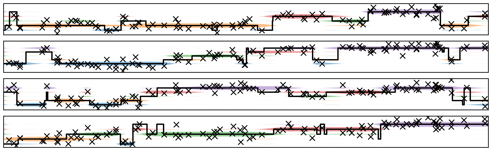

-----------------------------

# StarCTBN
A Python library for **approximate inference in continuous-time Bayesian networks (CTBNs)**. The library provides a
 computational framework for computing marginal posterior state distributions of a network's nodes from noisy
 time-coarse observation data using a **star approximation**. The underlying theory is described in 
 [this paper](https://papers.nips.cc/paper/8013-cluster-variational-approximations-for-structure-learning-of-continuous-time-bayesian-networks-from-incomplete-data):

```
@incollection{NIPS2018_8013,
title = {Cluster Variational Approximations for Structure Learning of Continuous-Time Bayesian Networks from Incomplete Data},
author = {Linzner, Dominik and Koeppl, Heinz},
booktitle = {Advances in Neural Information Processing Systems 31},
pages = {7880--7890},
year = {2018}
}
```

## Requirements
* Tested with Python 3.6.8

## Usage
The `CTBN` class forms the core of the library and provides all basic functionality for network inference. The
 simplest way to simulate your own network is to write a subclass that implements the `crm` function, which defines
 the system-specific conditional rate matrices (CRMs) of the network nodes for all possible configurations of their
 parents' states. For posterior state inference, the function `obs_likelihood` must be further implemented, which
 defines the observation model of the network. Synthetic observation data can be generated by implementing the 
 function `obs_rvs`, which provides the corresponding emission mechanism.
 
Alternatively, if the CRMs of the network nodes do not depend on the parent states explicitly but only on a set of
 summary statistics derived from the parent configuration, the `crm_stats` function should be implemented (in this
 case, pass the keyword argument `use_stats=True` when instantiating the model), which triggers a more efficient 
 inference scheme based on a sum-product procedure. This approach additionally requires the following functions to be
 implemented: 
* `set2stats`: defines how a given configuration of parent states translates into the corresponding summary statistics
* `stats_values`: generates all possible summary statistics for different parent set sizes
* `combine_stats`: defines the operation to combine the summary statistics of two node sets
* (optionally) `stats2inds`: returns the indices of a given set of summary statistics in the list of statistics
  produced by `stats_values`
   
For more details, check out the docstrings of the methods.

#### Example
To see an example, have look at [./src/potts.py](./src/potts.py) or run:
```
python src/potts.py
```
